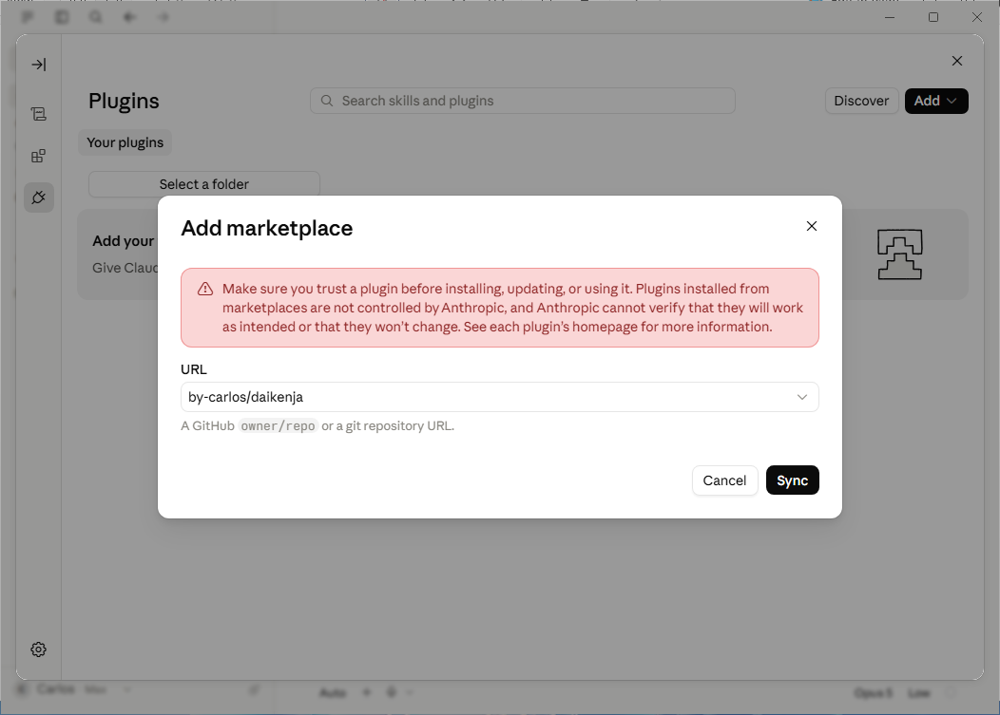
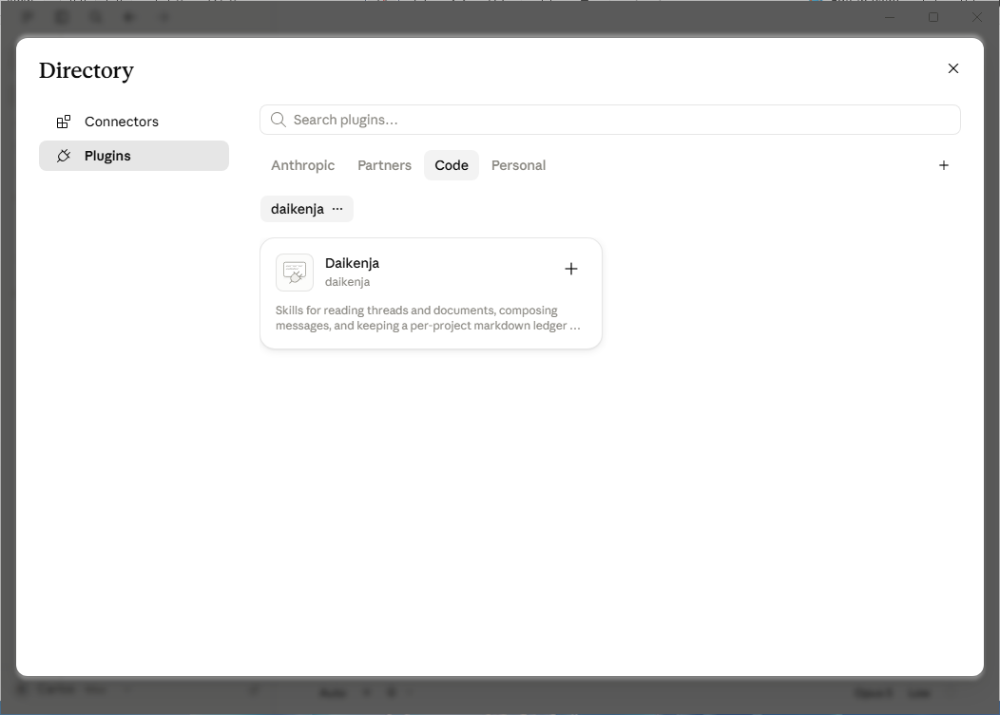

# Daikenja

**Not an assistant -- a sage you consult. It knows your work, the work around
you, and where to go next.**

Daikenja does not do your work. It reads the conversations, documents, meetings
and code you are buried in, asks what you are actually trying to do, and hands
back something you can act on -- a verdict on a draft, a review of how you
handled a thread, a plain markdown ledger of what a project decided and what is
still open. In a codebase that ledger is the why behind the code, which `git
blame` cannot give you. It never sends, never publishes, and never writes a word
you have not approved.

The writing and remembering side of a working week.

**Status:** in active development. Seventeen skills ship today.

## What using it looks like

A colleague drops a long thread on you and wants an answer today.

You paste it into `/daikenja:thread`. It does not write a reply. It tells you
what is actually being asked and by whom, then asks you the few things only you
know -- what you have already promised, what you are not willing to commit to.

You answer, and `/daikenja:compose` drafts the reply: clear and calm, in your
words, with your ask and your stance intact. If the message is one you cannot
afford to get wrong, `/daikenja:preflight` puts the draft in front of readers
who each look for a different failure -- the busy one, the executive, the one
who hunts for risk, the specific colleague you described to it -- then hands
back a revised draft plus the questions only you can answer. Nothing is sent.
You copy it out and send it yourself.

That thread settled two things, so you say so, and `/daikenja:project-log` shows
you the exact lines it wants to add to the project's ledger and waits for your
yes. The ledger is a markdown file that lives in the project, so git versions
it beside the code.

Three weeks later you come back and ask `/daikenja:project-catchup` what you
missed. It tells you what was decided while you were away, what is still open,
and who owes it.

Read, draft, record, come back to it later. That is the whole loop.

## Install

Daikenja is listed on the shared
[`by-carlos/claude-plugins`](https://github.com/by-carlos/claude-plugins)
marketplace, and this repo is also a marketplace in its own right -- so you can
install it on its own, without adding anything else first. Pick whichever of
these matches how you use Claude Code.

### Claude Desktop app

No terminal needed. Open the **Plugins** pane (the **+** button next to the
prompt box, then **Plugins**) and click **Add**. Put `by-carlos/daikenja` in the
**URL** box -- it takes a GitHub `owner/repo` directly, so there is nothing else
to paste -- then click **Sync**.



The plugin directory opens on its own once the sync finishes. Daikenja is under
the **Code** tab, with a **+** beside it -- click that, and it is installed.



The same **Plugins** pane is where you later enable, disable or remove it.

### Claude Code CLI

From inside a session:

```
/plugin marketplace add by-carlos/daikenja
/plugin install daikenja@daikenja
```

Or from your shell, without starting a session first:

```bash
claude plugin marketplace add by-carlos/daikenja
claude plugin install daikenja@daikenja
```

### After installing

However you installed it, run `/daikenja:setup-user` once. It checks the
environment and writes your configuration into `~/.claude/daikenja/`.

Then run `/daikenja:setup-project` in each project you want Daikenja to track.
It registers the directory, sets that project's own settings, and can seed its
ledger from a decision log, a wiki space or a Slack channel you already have.
`setup-user` is once per person; `setup-project` is once per project.

**A project does not have to be one directory.** A programme spanning three
repositories is registered once and every one of its directories resolves to
it; a body of work with no repository at all is registered with no directory,
reached by name, and keeps its ledger wherever its `ledger:` key points.
`/daikenja:project-list` shows the whole index back to you.

## Where it runs

**Daikenja is a Claude Code plugin.** It runs everywhere Claude Code does: the
**Claude Code CLI**, and the **Code** tab of the **Claude Desktop app**. You can
install it from either one -- the Desktop app has its own plugin menu, so you
never have to open a terminal. Local and SSH sessions both work.

It is not a claude.ai skill. The Claude Desktop app has three tabs, and only
**Code** runs Claude Code plugins -- **Chat** and **Cowork** (for Dispatch and
longer agentic work) do not, and neither does claude.ai itself, so Daikenja will
not show up in any of them. One more case worth knowing: a desktop **cloud**
session loads plugins from your claude.ai account rather than from your own
machine, so a Daikenja you installed locally will not be there either.

Settings come from `~/.claude/daikenja/`, or the `daikenja` folder in your
Google Drive if you opt into that -- see below.

**Typing `/daikenja:<skill>` always works, on every model.** Claude Code can
also start a skill just from plain language ("help me answer this thread"
triggering `/daikenja:thread`), but only if it has room to read that skill's
description -- and on a smaller-context model, a full Daikenja install plus a
couple of other plugins can be more than Claude Code has room for, so it falls
back to skill *names* only and plain-language triggering stops working for
Daikenja's skills. If that happens to you, use the slash form, or raise
`skillListingBudgetFraction` in your Claude Code settings to give skill
descriptions more room. (Measured 24 Aug 2026 on Claude Code 2.1.240,
[by-carlos/daikenja#199](https://github.com/by-carlos/daikenja/issues/199), on
a 200K-context model: Daikenja's thirteen auto-invocable descriptions alone run
about 8,600 characters against Claude Code's 8,000-character default budget,
and `skillListingBudgetFraction: 0.03` covers it. On a 1M-context model nothing
is cut and no setting is needed.)

## Skills

Seventeen skills, grouped by what they do.

**Writing a reply**

- `/daikenja:thread` -- reads a Slack or email thread, summarizes what is being
  asked and by whom, then collects context from you before any reply is
  drafted.
- `/daikenja:compose` -- rewrites or drafts a work message (Slack, Teams, email)
  so it stays clear, calm and easy to read, without changing the ask, the
  stance or the confidence level.
- `/daikenja:preflight` -- challenges a draft before it goes out. It runs the
  substance checks, puts the draft in front of reviewers who each read it for
  a different failure mode, fixes the wording problems they raise, and hands
  back a revised draft plus the facts only you can supply. It changes wording
  and never content.
- `/daikenja:remember-persona` -- records what you say about a person you write
  to, so later messages are written for that reader. The only skill that writes
  persona content.

**Writing the ledger**

- `/daikenja:project-log` -- records decisions and open items in a project's
  ledger. The only skill that writes ledger content; every other skill reads it.

**Reading the ledger**

- `/daikenja:project-catchup` -- reports what changed in a project's ledger
  since you last checked, then advances the checkpoint on approval.
- `/daikenja:project-summary` -- gives a full-state overview of a project's
  ledger, written for someone with no prior context.
- `/daikenja:project-decisions` -- looks up what was decided about a specific
  topic, including its supersession history.
- `/daikenja:project-gaps` -- audits a project's ledger for open items with no
  owner or that have sat too long.
- `/daikenja:project-sources` -- reports which of the documents a project is
  tracked from moved since you last read them, by comparing each source's
  stored last-modified value against what its system reports now. The mirror
  image of `project-catchup`: that one reports what Daikenja wrote, this one
  reports what moved outside.
- `/daikenja:project-list` -- lists every project Daikenja knows about, says
  which one you are standing in, and reports whether each ledger actually
  exists. The one to run when a read skill answered about a project you did not
  expect.

All five reading skills take an **optional project name**:
`/daikenja:project-summary atlas-migration` reads that project from anywhere,
without being in its directory.

**Reviewing things**

- `/daikenja:meeting-review` -- turns a meeting transcript into proposed ledger
  entries, then hands them to `/daikenja:project-log` for your approval.
- `/daikenja:doc-review` -- reviews a document against a fixed checklist before
  it is published or shared.
- `/daikenja:self-review` -- reviews how you handled a thread you took part in,
  with private, evidence-backed coaching on your own moves.

**Setup**

- `/daikenja:setup-user` -- one-time, re-runnable personal setup. Checks the
  environment, writes your `daikenja.yaml` and captures your profile. It does
  not register a project.
- `/daikenja:setup-project` -- once per project. Registers the directory you are
  in, offers that project's own settings, and can optionally seed its ledger
  from sources the project already has. Seeding proposes entries and hands them
  to `/daikenja:project-log` for your approval; it never writes the ledger
  itself.
- `/daikenja:learn-voice` (**beta**) -- works out how you write from writing
  samples you supply, and proposes the whole of your `writing-style.md`. Beta
  because it has been walked by hand against a fixture but not yet used on a
  real corpus, so read the proposal before you approve it. It reads only
  samples you say you wrote yourself, records style and never facts about
  people or projects, shows the complete file -- as a diff if you already have
  one -- and writes nothing until you approve it. Run it whenever you have more
  samples, not only at setup.

## Updating

New versions ship on the `release` branch.

### Claude Desktop app

Open the **Plugins** pane and select Daikenja. Its page shows the version you
have, how many skills it ships, and an **Update** button.

If that page keeps showing an old version after a release has gone out, remove
Daikenja and install it again -- a reinstall always picks up the current
version.

### Claude Code CLI

Run `/plugin` and open the **Marketplaces** tab. Selecting the Daikenja
marketplace gives you **Update marketplace** for a one-off, and **Enable
auto-update**, which has Claude Code refresh the marketplace and its installed
plugins in the background shortly after each session starts. That tab also tells
you which state you are currently in.

Auto-update is worth turning on, and worth checking rather than assuming:
Claude Code enables it by default for Anthropic's own marketplaces, not
necessarily for others. The toggle lives here in the CLI -- the desktop app's
plugin page updates on demand but does not expose it.

The same two actions from your shell:

```bash
claude plugin marketplace update
claude plugin update daikenja
```

However you update, a new version does not load into a session that is already
running: restart Claude Code, or run `/reload-plugins`.

### Do I have to re-run setup?

Usually not. Most releases change nothing that is already on your disk, and
Daikenja tells you when one does -- every skill that reads your configuration
compares the version that wrote it against the version installed, and prints a
single line when there is something to do:

```
daikenja.yaml was written by Daikenja 0.6.0; 0.7.0 is installed -- run /daikenja:setup-user.
```

That line is the signal. Run `/daikenja:setup-user` when you see it and it
proposes the exact edits and waits for your approval; ignore updating otherwise.
The notice deliberately stays quiet for releases that need nothing, so it does
not become something you learn to skip.

[`docs/upgrading.md`](docs/upgrading.md) is the same information written out to
apply by hand, newest version first.

## Where your data lives

Nothing personal is stored in this repository, and nothing personal should ever
be written into the installed plugin directory -- plugin directories are managed
and get overwritten on update.

| What | Where | Written by |
|---|---|---|
| Profile, per-project settings, checkpoints | `~/.claude/daikenja/daikenja.yaml` | `setup-user` for your profile, `setup-project` for a project's entry, and `project-catchup` for the `last_checkpoint` key only |
| Your notes on the people you work with | `~/.claude/daikenja/personas.md`, or `daikenja/personas.md` in your Google Drive | you, plus `remember-persona` for people you describe to it |
| How you write | `~/.claude/daikenja/writing-style.md`, or `daikenja/writing-style.md` in your Google Drive | you, plus `learn-voice` for a proposal you approve |
| A project's decision ledger | `<project root>/.daikenja/ledger.md`, or wherever that project's `ledger:` key points -- including outside the project. For a project spanning several directories the root is the first one registered | `project-log` only |

The plugin ships blank starting points in `templates/`. Those get copied out to
your directories; the copies are the live files.

**Local files are the default, and Google Drive is opt-in.** If you want your
persona notes or your writing style reachable from another machine, either one
can live in Google Drive instead -- `setup-user` offers this once, works fine
without it, and never asks you to sign up for anything. Drive is reached through
Google's own connector, under your own account, so nothing goes through the
plugin author. The two settings are independent: keeping personal notes on
colleagues local while sharing a writing style is a normal setup. The ledger
does not move -- it stays in the project, where git already versions it.

Everything Daikenja puts in Drive goes in **one `daikenja` folder** it creates
for you, mirroring `~/.claude/daikenja/` on your machine. Nothing is left loose
at the top level of your Drive.

Two things are worth knowing before you choose Drive. **`setup-user` has to
create the file**: the connector only shows Claude the files it created itself,
so a document already in your Drive cannot be pointed at, however you share it.
And **a Drive file that Daikenja cannot read stops the skill** rather than
quietly carrying on, because an unreadable file and an empty one look identical
from here -- the alternative is drafting in the default voice while you think
your own style was applied.

Two rules the skills follow:

- **One writer for the ledger.** Only the `project-log` skill writes ledger
  content. `project-catchup` writes one config key, `last_checkpoint`, because
  reporting a delta and moving the checkpoint is its job -- it never touches
  the ledger itself. `setup-project` can propose a whole ledger's worth of
  entries when it seeds one, and every last line still goes through
  `project-log` for your approval. Every other skill only reads.
- **You approve first.** A skill proposes a ledger entry, you confirm, then it
  writes.

## Development

Load the working tree straight into a session, from the repo root:

```bash
claude --plugin-dir .
```

Run `/reload-plugins` after editing a skill to pick up the change without
restarting. Validate the manifest with:

```bash
claude plugin validate .
```

Installing this repo as a **local marketplace** is not a substitute for the
above: it copies the tree into the plugin cache at install time rather than
referencing it live, so edits go stale until you reinstall. Use
`--plugin-dir .` for development.

Layout:

```
.claude-plugin/plugin.json        the manifest
.claude-plugin/marketplace.json   lists this repo as its own marketplace
skills/                           one directory per skill, each with a SKILL.md
templates/                        blank files copied out to the user
docs/                             the ledger and config specifications
tests/                            invariant checks and the hand-run fixtures
```

`docs/` holds the contracts. A skill implements a contract and never redefines
one, so a format change happens in `docs/` first. `tests/check-invariants.py`,
run in CI, catches the parts of this it can check mechanically (like a
skill's headings drifting from what a contract's reverse index expects).

## Contributing

Bugs and ideas go to [the issue tracker](https://github.com/by-carlos/daikenja/issues).
A problem with the marketplace listing itself belongs in
[`by-carlos/claude-plugins`](https://github.com/by-carlos/claude-plugins),
which owns the catalog.

[`CONTRIBUTING.md`](CONTRIBUTING.md) has the rest: what an issue needs, the
branch and commit conventions, when a change owes a changelog entry or an
upgrade note, and the conventions that are easiest to trip over. Read it before
opening a pull request.

**Do not report a security problem in a public issue.**
[`SECURITY.md`](SECURITY.md) says how to reach the maintainer privately.

## License

[FSL-1.1-ALv2](LICENSE) -- free for any use except building a competing
commercial product, and each release becomes Apache-2.0 two years after it is
made available. Versions released before this change remain MIT.
